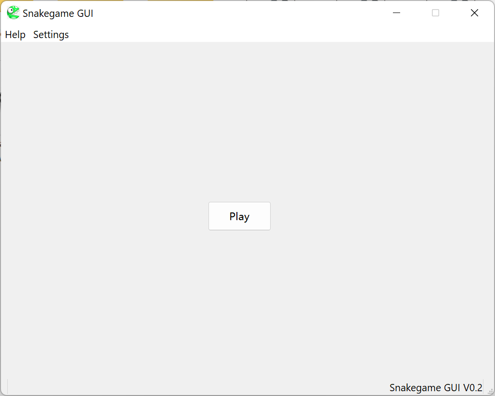
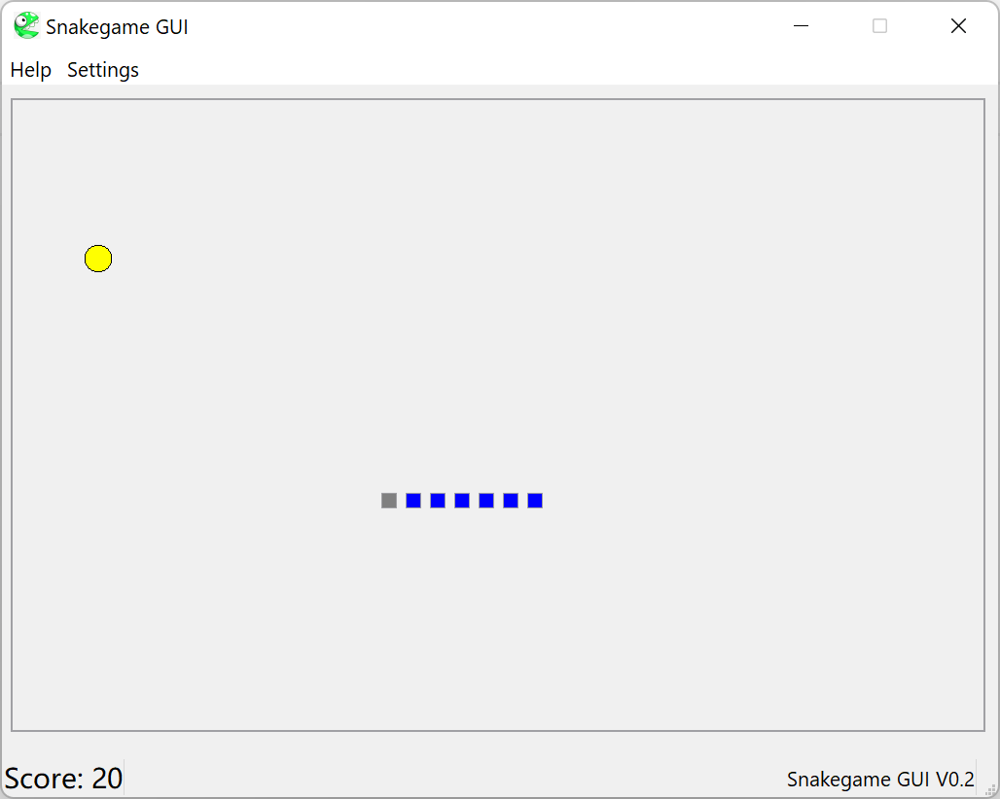
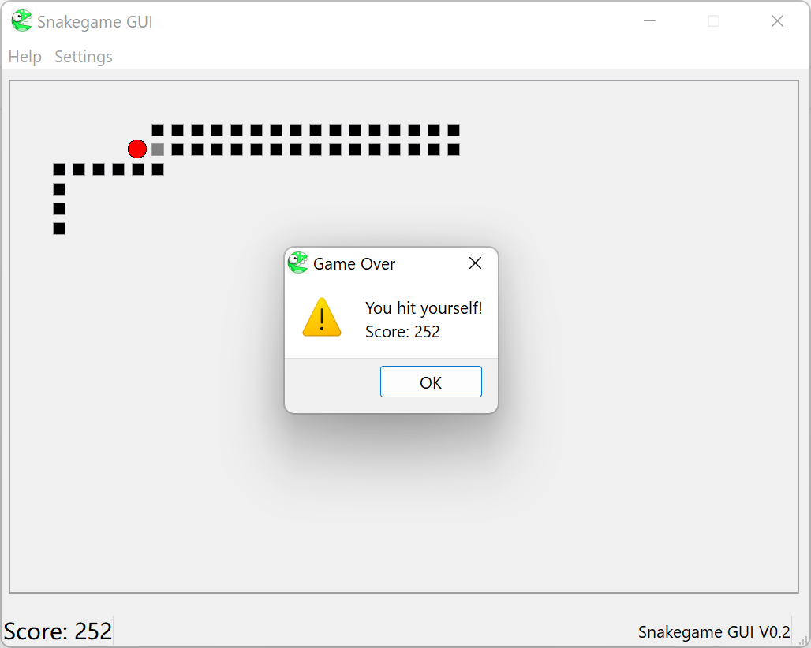

## 大学C++课程经典作业之一：贪吃蛇

使用Qt5。固定了窗口大小。

拥有的功能：

- 分难度游戏，每个难度得分不同，移动速度不同

- 可以选择不同地图进行游戏，不同地图拥有各自的障碍物地形，没有障碍的边界可以穿过并从另一侧穿出

- 拥有特殊效果的食物，可以获得额外得分，无敌和减少长度奖励效果

一些还可以添加的功能：

- 分数记录，分地图记录最高记录

- 将蛇改为条形显示，在盘旋时容易看清几何关系

- 增加其他有趣的食物效果

- 增加地图，将地图数据从头文件常量更改为外部读取

代码的缺陷：

- 游戏结构简单，游戏开始/暂停/结束等其他模块没有封装，略显混乱

- 菜单栏槽函数过于繁琐复杂，应该让槽函数统一调用同一个修改难度/地图的函数，减小代码量增大可读性。